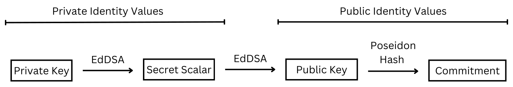
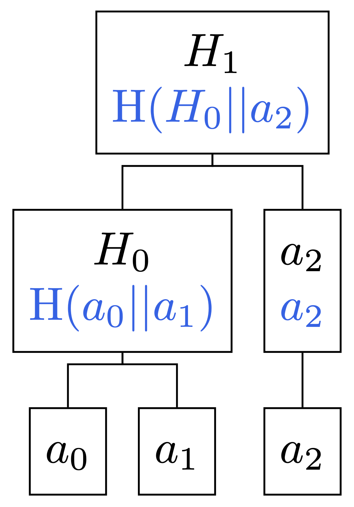

# Semaphore V4 Specification

# Change Process

This document is governed by the [1/COSS](https://github.com/zkspecs/zkspecs/tree/main/specs/1) (COSS).

# Language

The key words "MUST", "MUST NOT", "REQUIRED", "SHALL", "SHALL NOT", "SHOULD", "SHOULD NOT", "RECOMMENDED", "MAY", and "OPTIONAL" in this document are to be interpreted as described in [RFC 2119](https://www.ietf.org/rfc/rfc2119.txt).

# Abstract

Semaphore V4 is a privacy-preserving, general-purpose protocol that allows users to prove they are part of a group and broadcast [signals](#message) without revealing their identity. Designed to be simple, lightweight, and highly efficient, it leverages a Merkle tree structure to minimize computational costs and provide strong security guarantees.

Users generate their own Semaphore identity, which they can use to join a group structured as a Merkle tree, provided they meet the required criteria—typically proving ownership of specific credentials. Once added as a leaf, Semaphore enables them to anonymously share arbitrary [messages](#message), such as votes or endorsements, by proving their group membership within a zero-knowledge circuit, which also implicitly confirms they meet the group’s entry criteria.

# Motivation

Although Semaphore was created in 2019, its core motivations remain just as relevant today. Privacy continues to be a major challenge in digital identity, yet existing solutions are often either overly complex and difficult to use or, conversely, too simplistic to be practical.

Despite advances in cryptographic primitives, most tools require intricate infrastructures that are hard for developers to grasp, while others rely solely on basic zero-knowledge signature verification. However, these approaches are often inefficient or lack strong security guarantees.

Semaphore specifically aims to address the following challenges:

- **Minimizing complexity**: Semaphore offers a simple and intuitive scheme. Users only need to create their identity and join a group with their credentials.
- **Maintaining efficiency**: zk proofs (zero-knowledge proofs) can be generated and verified in under a second, ensuring fast and scalable performance.
- **General-purpose design**: Semaphore is versatile and applicable to any use case where credential verification is required.
- **Beyond anonymity**: In addition to preserving privacy, Semaphore provides key security guarantees, including:
  - **Double-signaling prevention**: Each zk proof includes a unique, deterministic nullifier to prevent reuse and ensure one-time [signaling](#signaling).
  - **Unlinkability**: All group members appear indistinguishable when generating zk proofs, preventing correlation across interactions.

# Specification

## System Requirements

Implementations MUST provide:

### 1. Identity

Semaphore V4 identities use the [EdDSA](https://www.rfc-editor.org/rfc/rfc8032) signature scheme, implemented with the [Baby Jubjub](https://eips.ethereum.org/EIPS/eip-2494) elliptic curve and the [Poseidon](#poseidon-hash-function) hash function.

An identity serves as a unique identifier for users and consists of an EdDSA public/private key pair along with a commitment.

The private key is a secret value, generated randomly or derived from other secrets, and is used to generate the public key. The public key consists of a pair of coordinates representing a point on the elliptic curve.

The identity commitment is computed as the Poseidon hash of the public key and acts as the public Semaphore identity, which is used in Semaphore groups. Instead of exposing the public key directly, it is RECOMMENDED to use the identity commitment, as it provides an additional layer of security and ensures a more compact, standardized representation of the identity.



**Semaphore identity:**

```text
{
  privateKey: bytes32        // The EdDSA private key
  secretScalar: bytes32      // The secret scalar derived from the private key.
  publicKey: Point<bytes32>  // The EdDSA public key, derived from the secret scalar
  commitment: bytes32        // The identity commitment used as a public value in Semaphore groups
}
```

The secret scalar is a value derived from the private key and used in the circuit to generate the commitment.

Using the secret scalar in the circuit instead of the private key allows it to skip steps 1, 2, 3 in the generation of the public key defined in [RFC 8032](https://www.rfc-editor.org/rfc/rfc8032#section-5.1.5), making the circuit more efficient and simple.

Instead of SHA-512, the Blake 1 hash function is used to generate the secret scalar. This decision was made to maintain compatibility with the [circomlibjs implementation](https://github.com/iden3/circomlibjs/blob/main/src/eddsa.js) and the protocols that rely on it.

### 2. Group

A group is a collection of identities represented in a structured format.

A Semaphore group is a [Merkle Tree](#merkle-tree) in which each leaf is an identity commitment for a user.

Semaphore uses the LeanIMT implementation, which is an optimized binary [Incremental Merkle Tree](#incremental-merkle-tree). The tree nodes are calculated using [Poseidon](#poseidon-hash-function). For more details on this data structure, see [Appendix A: LeanIMT](#appendix-a-leanimt).

The group can support additional functions, but these are the primary ones:

- Add member: Add an identity commitment to the leaves of the tree.
- Update member: Update an identity commitment (a value of a leaf).
- Remove member: Remove an identity commitment from the leaves.
- Create proof of membership: Generate a [Merkle proof](#merkle-proof) of a leaf in the LeanIMT.

### 3. Nullifier

The nullifier is a value designed to be a unique identifier for the zk proof. It is used to prevent the same zk proof from being used twice. In Semaphore, the nullifier is the Poseidon hash of the scope and secret scalar value of the user's Semaphore identity.

```
nullifier := Poseidon(scope || secret)
```

#### Scope

A value used like a topic on which users can generate a valid zk proof only once.

#### Secret

The secret scalar derived from the identity private key.

When using the same scope for an identity, the resulting nullifier remains the same because the same hash is generated. To obtain different nullifiers for the same identity (allowing users to share multiple zk proofs) users must use a different scope each time.

## Protocol Flow

After users have generated their Semaphore identity and joined the group, implementations MUST:

1. Get the secret scalar from the Identity
2. Generate Merkle proof using the identity and Group
3. Generate circuit inputs

Input requirements:

```
{
  secretScalar: bytes32           // Identity Secret Scalar
  merkleProofLength: uint8        // Length of Merkle proof Siblings
  merkleProofIndices: uint8[]     // List of Indices to recompute the Merkle root
  merkleProofSiblings: bytes32[]  // Merkle proof Siblings
  scope: bytes32                  // Scope to generate the nullifier
  message: bytes32                // Message to share
}
```

## Circuit Design

### Private Inputs

- `merkleProofLength`: Length of the Merkle Proof (Siblings Length) used to calculate the Merkle root.
- `merkleProofSiblings`: Merkle Proof Siblings used to calculate the Merkle root.
- `merkleProofIndices`: Merkle Proof Indices used to calculate the Merkle root.
- `secret`: The secret is the scalar generated from the EdDSA private key.

### Public Inputs

- `message`: The value the user shares when voting, confirming, sending a text message, etc.
- `scope`: A value used like a topic on which users can generate a valid zk proof only once. The scope is supposed to be used to generate the nullifier.

### Circuit Operations

1. **EdDSA public key generation**: The EdDSA public key is derived from the `secret` using Baby Jubjub. The public key is a point with two coordinates (`Ax`, `Ay`).

   ```
   (Ax, Ay) := BabyPbk()(secret)
   ```

2. **Identity Commitment generation**: Calculate the hash of the public key. This hash is the Identity Commitment.

   ```
   identityCommitment := Poseidon(Ax || Ay)
   ```

3. **Proof of membership verification**: The Merkle root passed as output must be equal to that calculated within the circuit through the inputs of the Merkle proof. For more details, see [Appendix B: LeanIMT Root Circuit](#appendix-b-leanimt-root-circuit).

   ```
   merkleRoot := LeanIMTRoot(identityCommitment, merkleProofLength, merkleProofIndices, merkleProofSiblings)
   ```

4. **Nullifier generation**: The nullifier is generated by calculating the hash of the `scope` and the `secret`.

   ```
   nullifier := Poseidon(scope || secret)
   ```

5. **Dummy Square**: As the message is not really used within the circuit, the square applied to it is a way to force Circom's compiler to add a constraint and prevent its value from being changed by an attacker. More information in [this article by the Geometry team](https://geometry.xyz/notebook/groth16-malleability). This dummy square is tied to Circom and may not be necessary when using other technologies.

   ```
   dummySquare := message * message
   ```

### Outputs

- `merkleRoot`: Merkle root of the LeanIMT.
- `nullifier`: A value designed to be a unique identifier for the zk proof. It is used to prevent the same zk proof from being used twice. It's derived from the `scope` and `secret`.

### Component Interaction


### Proof Generation

#### Prover MUST

- Generate the EdDSA public key using the `secret` value.
- Generate the identity commitment using the EdDSA public key.
- Verify proof of membership and generate the Merkle root.
- Generate a unique nullifier.

#### Semaphore Proof Output Format

```text
{
  merkleTreeDepth: uint8,   // Merkle Tree Depth
  merkleTreeRoot: bytes32,  // Merkle Tree Root
  nullifier: bytes32,       // Unique identifier for the zk proof
  message: bytes32,         // Message to share
  scope: bytes32            // Scope
  proof: bytes              // Zero-Knowledge Proof
}
```

### Proof Verification

#### Verifier MUST

- Validate the zero-knowledge proof provided by the user.

#### Verifier SHOULD

- Check if the nullifier has already been used to prevent double-signaling.

#### Verifier MAY

- Validate zk proofs that reference a `merkleTreeRoot` that was once valid but is no longer valid due to changes in the tree. For more details, see [Appendix C: Tree Root history](#appendix-c-tree-root-history).

## Error Handling

Implementations MUST handle:

- Invalid zk proof

Implementations SHOULD handle:

- Duplicate nullifier

Error responses MUST include:

- Error code
- Error message
- Error details (when available)

# Interoperability Constraints

It is RECOMMENDED to use:

- EdDSA for the Identity component since it is a [zk-friendly](#zk-friendly) signature scheme. This allows the creation and verification of signatures using Semaphore identities. While other signature schemes could be used, they would not be compatible with the way Semaphore V4 identities are structured.
- LeanIMT for the Group component because it efficiently supports adding, updating, and removing leaves while enabling proofs and verifications that a given leaf belongs to the tree (i.e., that an identity is part of a group). Other group representations can be used, but they will not be compatible with the current Semaphore V4 implementation.
- Poseidon hash function in the circuit because it is zk-friendly. While other hash functions could be used, they would generate different outputs, making the identity commitment, group and nullifier incompatible with Semaphore V4.

# Security Considerations

### Privacy and Security Assumptions

The protocol assumes:

- The proven security of the used proving system, and the trusted setup of the circuit if required by the proving system being used.
- The proven security of the hash functions used.
- The larger the group, the harder it is to distinguish individual members, as anonymity increases with the number of participants (larger anonymity set).

### Privacy and Security Best Practices

- Both the private key and secret scalar SHOULD remain confidential and under the owner's control by performing identity generation off-chain on the user's device. This ensures that private identity values never leave the device, preventing identity reconstruction and unauthorized zk proof generation.
- The Merkle proof (used to generate the zk proof) SHOULD be generated on the user's device to prevent exposing the identity commitment (leaf) used in the zk proof generation.
- The zk proof SHOULD be performed off-chain on the user's device. Generating it on a server will allow the server to deanonymize the proof.

### Known limitations

#### 1. Scalability

As the number of members increases, rebuilding the tree (Semaphore Group) to generate a client-side Merkle proof becomes impractical due to memory constraints and longer processing times, ultimately degrading the user experience.

[Appendix D: LeanIMT Benchmarks](#appendix-d-leanimt-benchmarks) shows that while small member sets are processed almost instantly, larger sets require significantly more time. Processing times increase from milliseconds for a few members to several minutes for millions of members. This delay makes real-time or frequent tree rebuilding infeasible for large-scale applications.

**Possible solutions for scalability:**

- A data structure that can limit the size of the trees, similar to the [Merkle Forest](https://github.com/Poseidon-ZKP/merkle-forest).
- [Private Information Retrieval (PIR)](https://en.wikipedia.org/wiki/Private_information_retrieval).

#### 2. Privacy in Group Joining

Semaphore enables users to prove group membership without revealing their identity. However, joining a group typically requires sharing personal information with the group administrator, which is problematic when users want to keep data, like proof of identity or reputation, private.

#### 3. Immediate Proof Generation After Joining a Group

If members join a group and immediately generate a proof, their identity may be inferred, compromising privacy.

**Example: Anonymous Event Feedback**
Consider an event app that allows attendees to submit anonymous feedback. The app has a list of registered participants' emails but does not yet have a Semaphore group with these participants. If users generate their Semaphore identity and are added to the group right before submitting feedback, their anonymity is compromised, an observer could link new additions to generated proofs, revealing their identity.

**Correct Usage**
To maintain privacy, attendees need to generate their Semaphore identity and be added to the group in advance. Anonymous feedback submissions can take place once all users are included.

### Privacy Guarantees

The protocol MUST guarantee:

- That users cannot be deanonymized, i.e. the identity cannot be linked to the zk proof.

# Implementation Notes

The current [reference implementation](https://github.com/semaphore-protocol/semaphore) of the protocol is built with [Circom](https://docs.circom.io/) Groth16, and [snarkjs](https://github.com/iden3/snarkjs).

### Proof Generation

```ts
// Generate the circuit input parameters using the function parameters
// 1. Use the secretScalar from the identity
// 2. Use the commitment from the identity and calculate the merkleProofLength, merkleProofIndices and merkleProofSiblings
// 3. Call the snarkjs prove function
const semaphoreProof = await generateProof(identity, group, message, scope)
```

### Proof Verification

```ts
// Call the snarkjs verify function
const verified = await verifyProof(semaphoreProof)
```

# References

1. [Semaphore Whitepaper](https://semaphore.pse.dev/whitepaper-v1.pdf)
2. [Semaphore GitHub organization](https://github.com/semaphore-protocol)
3. [Semaphore repository](https://github.com/semaphore-protocol/semaphore)

# Glossary

## Message

In Semaphore, the term message (also known as _signal_) refers to the value a user shares when performing actions such as voting, confirming, sending a text message, and more.

## Signaling

The act of sharing a message (e.g., a text message or vote).

## ZK-friendly

zk-friendly refers to functions or data structures optimized for efficient computation in zero-knowledge proofs. They reduce constraints in proving systems like zk-SNARKs, lowering costs and proof sizes. Examples include Poseidon (hash function) and LeanIMT (data structure).

## Poseidon Hash Function

Poseidon is a zk-friendly hash function.

The [Poseidon](https://eprint.iacr.org/2019/458.pdf) implementation used by Semaphore operates over the BN254 elliptic curve and uses the POSEIDON<sup>π</sup> − 128 instantiation.

## Binary Tree

A Binary Tree is a tree data structure in which each node has at most two children, referred to as the left child and the right child.

## Incremental Merkle Tree

An Incremental Merkle Tree (IMT) is a Merkle Tree (MT) designed to be updated efficiently by only appending new entries to the right-hand side.

## Merkle Tree

A Merkle Tree (MT) is a tree (usually a binary tree) in which every leaf is a hash and every node that is not a leaf is the hash of its child nodes.

## Merkle Proof

A Merkle proof is a proof that verifies the inclusion of a specific data element in a Merkle tree using a minimal set of hashes, allowing efficient and secure validation without revealing the entire dataset.

# Appendix A: LeanIMT

The LeanIMT (Lean Incremental Merkle Tree) is a Binary IMT with two fundamental properties:

1. Every node with two children is the hash of its left and right nodes.
2. Every node with one child has the same value as its child node.

**Key Characteristics:**

- The tree is always built from the leaves to the root.
- The tree will always be balanced by construction.
- The tree depth is dynamic and can increase with the insertion of new leaves.
- To calculate a parent hash with two children, always start with the left child followed by the right. The order is never reversed.

For more details on the LeanIMT, refer to the [LeanIMT paper](https://github.com/privacy-scaling-explorations/zk-kit/tree/main/papers/leanimt).

## Example of a LeanIMT Structure

T - Tree
V - Vertices (Nodes)
E - Edges (Lines connecting Nodes)

T = (V, E)
V= {a0, a1, a2, H0, H1}
E= {(a0, H0), (a1, H0), (a2, a2), (H0, H1), (a2, H1)}

<div style="text-align: center;">
    
</div>

## Insert

Function to insert a new leaf into a LeanIMT.

When inserting a new leaf, one of the following cases will occur at each level:

1. The new node is the left child:
   - The node will not be hashed.
   - Its value will be sent to the next level.
2. The new node is the right child:
   - The parent node will be the hash of the node’s sibling with itself.

## Update

Function to update the value of a leaf of a LeanIMT.

At each level, when updating a leaf's value, the impact depends on whether the node has a sibling:

1. No sibling:

   - The parent node inherits the new value directly.

2. Has a sibling:
   - The parent node’s value is updated as the hash of the updated node’s new value and its sibling.

## Remove

Function to remove a leaf from a LeanIMT.

Removing a leaf follows the same logic as the update function, but the leaf’s value is replaced with 0 (or another reserved invalid value).

Effect: The parent node’s value is recalculated using this placeholder value.

## Generate Merkle Proof

Function to generate a Merkle proof of a leaf in a LeanIMT.

Merkle proofs verify the existence of a node in the tree. At each level, this process depends on whether the node has a sibling:

1. No Sibling:

   - Nothing is added to the proof at this level.
   - This case occurs when the node is both the last node in the level and a left node.

2. Has a Sibling:
   - If the node is a right child, 1 is added to the proof path, and the left sibling is stored
   - If the node is a left child, 0 is added to the proof path, and the right sibling is stored.

# Appendix B: LeanIMT Root Circuit

The LeanIMT Root circuit is designed to calculate the root of a LeanIMT given a leaf, its depth, and the necessary sibling information (aka proof of membership). A circuit is designed without the capability to iterate through a dynamic array. To address this, a parameter with the static maximum tree depth is defined (i.e. 'MAX_DEPTH'). And additionally, the circuit receives a dynamic depth as an input, which is utilized in calculating the true root of the Merkle tree. The actual depth of the Merkle tree may be equal to or less than the static maximum depth. Make sure to enforce `depth <= MAX_DEPTH` outside the circuit.

This circuit is compatible with Binary Merkle Trees.

# Appendix C: Tree Root History

When the Merkle tree changes (due to adding, removing, or updating a member), the Merkle root also changes. If someone generates a zk proof using an outdated root (prior to the change), the proof itself remains valid, but verification will fail since the current root no longer matches the one used for proof generation. Ideally, these proofs should still be verifiable.

One possible solution is to keep track of the past Merkle roots, allowing verification against those that were valid within a defined period. This ensures that proofs remain valid for a certain time even after the tree is updated.

# Appendix D: LeanIMT Benchmarks

The table below provides estimated build times for a LeanIMT with different numbers of members.

All the benchmarks were run in an environment with these properties:

**System Specifications:**

Computer: MacBook Pro
Chip: Apple M2 Pro
Memory (RAM): 16 GB
Operating System: macOS Sequoia version 15.3

**Software environment:**

Browser: Google Chrome Version 133.0.6943.127 (Official Build) (arm64)

**Time Units:**

ms: milliseconds
s: seconds
min: minutes

| Members   | Time   |
| --------- | ------ |
| 100       | 31 ms  |
| 1 000     | 148 ms |
| 200 000   | 24 s   |
| 500 000   | 1 min  |
| 1 000 000 | 2 min  |
| 2 000 000 | 4 min  |
| 3 000 000 | 6 min  |

# Copyright

Copyright and related rights waived via [CC0](https://creativecommons.org/publicdomain/zero/1.0/).
