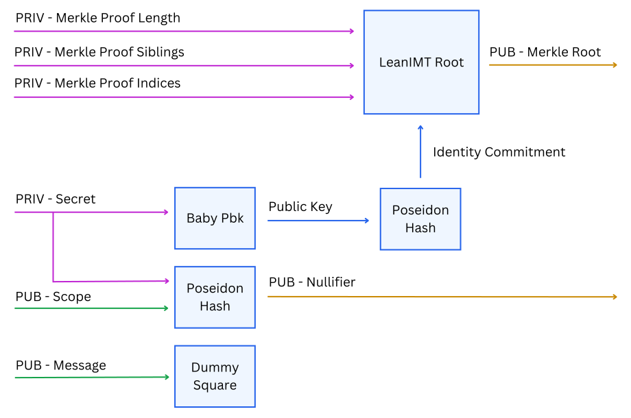

# Semaphore Specification

## Change Process

This document is governed by the [1/COSS](https://github.com/zkspecs/zkspecs/tree/main/specs/1) (COSS).

## Language

The key words "MUST", "MUST NOT", "REQUIRED", "SHALL", "SHALL NOT", "SHOULD", "SHOULD NOT", "RECOMMENDED", "MAY", and "OPTIONAL" in this document are to be interpreted as described in [RFC 2119](https://www.ietf.org/rfc/rfc2119.txt).

## Abstract

Semaphore is a [zero-knowledge](https://en.wikipedia.org/wiki/Zero-knowledge_proof) (zk) protocol that allows users to prove their membership in a group and send messages such as votes or feedback without revealing their identity.

It also provides a simple mechanism to prevent [double-signaling](#signaling), which means that the same proof cannot be verified twice.

## Motivation

Privacy remains a significant challenge in the digital world, with existing solutions often being limited, hard to extend, and overly complex. These limitations make it difficult to create privacy-preserving applications and prevent users from securely interacting without exposing their identities. Semaphore addresses these issues by enabling the sharing of anonymous [messages](#message), solving the critical need for privacy while maintaining transparency.

## System Components

Implementations MUST provide:

### 1. Identity

An identity serves as a unique identifier for users.

### 2. Group

A group is a collection of identities represented in a structured format.

### 3. Anonymous Proof of Membership

An anonymous proof of membership enables users to prove their inclusion in a group without revealing their identity.

### 4. Nullifier

A value designed to be a unique identifier for the zk proof. It is generated using the identity.

### 5. Anonymous Message

After joining a group (an identity is added to a group) and proving that they are part of it, users can also send an anonymous message.

## Interaction of System Components

Semaphore Flow:

1. The user generates an identity.
2. The identity is added to the group.
3. An anonymous membership proof can be generated using the identity and group.
4. A nullifier is generated to uniquely represent the user's zk proof while ensuring anonymity.
5. The user can attach an anonymous message (such as a vote, text message).

<div style="text-align: center;">
    
</div>

## Implementation

There are some Semaphore implementations such as [Semaphore v3](https://docs.semaphore.pse.dev/V3) and [Semaphore v4](https://docs.semaphore.pse.dev/) both developed by [PSE](https://pse.dev/). While they follow the same system components, they have differences. To learn more about the differences, you can read [Appendix A: Semaphore v3 and v4 implementations](#appendix-a-semaphore-v3-and-v4-implementations).

The implementation section will refer to [Semaphore v4](https://github.com/semaphore-protocol/semaphore/releases/tag/v4.0.0) implemented by [PSE](https://pse.dev/). The same logic can be applied to implement Semaphore v4 with other tech stacks such as [Noir](https://noir-lang.org/) or [Rust](https://www.rust-lang.org/).

Semaphore's zk functionality is implemented using [Circom](https://github.com/iden3/circom) + [Snarkjs](https://github.com/iden3/snarkjs) + [Groth16](https://eprint.iacr.org/2016/260.pdf).

- **Circom**: Used to write the circuit and generate its [R1CS constraint system](https://docs.circom.io/background/background/#_1).
- **Snarkjs**: Used to generate [zk-artifacts](#zk-artifacts) as well as to create and verify zk-SNARK proofs.
- **Groth16**: Used as a proving system.

### Semaphore Identity

The identity of a user in the Semaphore protocol. A Semaphore identity consists of an [EdDSA](https://en.wikipedia.org/wiki/EdDSA) public/private key pair and a commitment. Semaphore uses an [EdDSA implementation](https://github.com/privacy-scaling-explorations/zk-kit/tree/main/packages/eddsa-poseidon) based on [Baby Jubjub](https://eips.ethereum.org/EIPS/eip-2494) and [Poseidon](https://www.poseidon-hash.info/).

#### Identity Commitment

The Identity Commitment is the public Semaphore identity value used in Semaphore groups. Semaphore uses the Poseidon hash function to create the identity commitment from the Semaphore identity public key.

### Semaphore Group

A [Semaphore group](https://github.com/semaphore-protocol/semaphore/tree/main/packages/group) is a Merkle tree in which each leaf is an identity commitment for a user.

Semaphore uses the **LeanIMT** implementation, which is an optimized binary incremental Merkle tree. The tree nodes are calculated using Poseidon. To learn more about it you can read the [LeanIMT paper](https://github.com/privacy-scaling-explorations/zk-kit/tree/main/papers/leanimt).

### Circuit



#### Private Inputs

- `merkleProofLength`: Length of the Merkle Proof (Siblings Length) used to calculate the Merkle Root.
- `merkleProofSiblings`: Merkle Proof Siblings used to calculate the Merkle Root.
- `merkleProofIndices`: Merkle Proof Indices used to calculate the Merkle Root.
- `secret`: The secret is the scalar generated from the EdDSA private key. Using the secret scalar instead of the private key allows this circuit to skip steps 1, 2, 3 in the generation of the public key defined in [RFC 8032](https://www.rfc-editor.org/rfc/rfc8032#section-5.1.5), making the circuit more efficient and simple. See the [Semaphore identity package](https://github.com/semaphore-protocol/semaphore/tree/main/packages/identity) to know more about how the identity is generated.

#### Public Inputs

- `message`: The value the user shares when voting, confirming, sending a text message, etc.
- `scope`: A value used like a topic on which users can generate a valid proof only once. The scope is supposed to be used to generate the nullifier.

#### Circuit Operations

1. **EdDSA public key generation**: The EdDSA public key is derived from the `secret` using Baby Jubjub. The public key is a point with two coordinates.

2. **Identity Commitment generation**: Calculate the hash of the public key. This hash is the Identity Commitment.

3. **Proof of membership verification**: The Merkle root passed as output must be equal to that calculated within the circuit through the inputs of the Merkle proof.

4. **Nullifier generation**: The nullifier is generated by calculating the hash of the `scope` and the `secret`.

5. **Dummy Square**: As the message is not really used within the circuit, the square applied to it is a way to force Circom's compiler to add a constraint and prevent its value from being changed by an attacker. More information in [this article by the Geometry team](https://geometry.xyz/notebook/groth16-malleability).

#### Outputs

- `merkleRoot`: Merkle Root of the LeanIMT.
- `nullifier`: A value designed to be a unique identifier for the zk proof. It is used to prevent the same zk proof from being used twice. In Semaphore, the nullifier is the hash of the scope and secret value of the user's Semaphore identity.

When using the same scope for an identity, the resulting nullifier remains the same because the same hash is generated. To obtain different nullifiers for the same identity (allowing users to share multiple zk proofs) users must use a different scope each time.

### Proof Generation

Snarkjs is used to generate the proof.

```ts
const { proof, publicSignals } = await groth16.fullProve(
  {
    secret: identity.secretScalar,
    merkleProofLength,
    merkleProofIndices,
    merkleProofSiblings,
    scope: hash(scope),
    message: hash(message)
  },
  wasm,
  zkey
)

return {
  merkleTreeDepth,
  merkleTreeRoot: merkleProof.root.toString(),
  nullifier: publicSignals[1],
  message: message.toString() as NumericString,
  scope: scope.toString() as NumericString,
  points: packGroth16Proof(proof)
}
```

To learn more about the proof generation, see the [proof generation code](https://github.com/semaphore-protocol/semaphore/blob/main/packages/proof/src/generate-proof.ts).

#### Semaphore Proof Example

```bash
{
  merkleTreeDepth: 10,
  merkleTreeRoot: '4990292586352433503726012711155167179034286198473030768981544541070532815155',
  nullifier: '17540473064543782218297133630279824063352907908315494138425986188962403570231',
  message: '32745724963520510550185023804391900974863477733501474067656557556163468591104',
  scope: '37717653415819232215590989865455204849443869931268328771929128739472152723456',
  points: [
    '21668337069844646813015291115284438234607322052337623326830707330064154913250',
    '5484905467799538881631237123282286864306155680753671338313686933143657835972',
    '16129789229127169079253218689550197285028424883172925653046098078118792423164',
    '20777706122379854993524659601832014684665489694335277047215897593373874956681',
    '6697558559751679943942291885282718275907555268106795371542167431979105110434',
    '19709269142703129641057076037387702381970592578248722843989118216760760132874',
    '17493422037248079872314969622558990504818232868144223100447800353776555945950',
    '20398320346518400096197920333973312490517624241764728676355205902471625807914'
  ]
}
```

### Proof Verification

Proof verification works both off-chain and on-chain (on [EVM-compatible chains](#evm-compatible-chains) where the Groth16 Semaphore verifier can be deployed).

Semaphore v4 is currently deployed on many networks, the full list can be found in the [Semaphore Docs](https://docs.semaphore.pse.dev/deployed-contracts).

#### Off-chain

Snarkjs is used to verify the proof.

```ts
return groth16.verify(
  verificationKey,
  [merkleTreeRoot, nullifier, hash(message), hash(scope)],
  unpackGroth16Proof(points)
)
```

To learn more about the proof verification in TypeScript/JavaScript, see [the proof verification code](https://github.com/semaphore-protocol/semaphore/blob/main/packages/proof/src/verify-proof.ts).

#### On-chain

Snarkjs is used to generate a Solidity verifier per tree depth. Then, all verifiers are merged into a single one. To know more about the verifier see the [Semaphore Verifier](https://github.com/semaphore-protocol/semaphore/blob/main/packages/contracts/contracts/base/SemaphoreVerifier.sol).

```solidity
return
    verifier.verifyProof(
        [proof.points[0], proof.points[1]],
        [[proof.points[2], proof.points[3]], [proof.points[4], proof.points[5]]],
        [proof.points[6], proof.points[7]],
        [proof.merkleTreeRoot, proof.nullifier, _hash(proof.message), _hash(proof.scope)],
        proof.merkleTreeDepth
    );
```

### Implementation Notes

These are the key components of Semaphore v4's implementation. When implementing Semaphore v4 with a different tech stack, these components should be rewritten, updated, or reused as needed.

<div style="text-align: center;">
    
</div>

- The Identity implementation SHOULD be compatible across all the other components: Group, Circuit, Proof and Smart Contracts.
- The Group implementation SHOULD be compatible across all the other components: Identity, Circuit, Proof and Smart Contracts.
- Identity generation SHOULD be performed off-chain, in the user's device.
- Semaphore proof generation SHOULD be performed off-chain, in the user's device.

For the implementation of Semaphore v4 it is RECOMMENDED to:

- Use EdDSA in the Identity component because it is a zk-friendly signature scheme. This allows the creation and verification of signatures using Semaphore identities.
- Use LeanIMT in the Group component because it provides an efficient way to prove and verify that a leaf is part of a tree (i.e., that an identity is part of a group).
- Use the Poseidon hash function in the circuit because it is a zk-friendly hash function.

### Limitations of the implementation

- **Scalability**: As the number of members grows, generating a client-side Merkle proof is no longer feasible. It’s necessary to have a server to do it. This not only is time and data consuming, but could also allow the server to deanonymize the proofs.
  - Possible solutions: A data structure similar to the [Merkle Forest](https://github.com/Poseidon-ZKP/merkle-forest), [Private Information Retrieval (PIR)](https://en.wikipedia.org/wiki/Private_information_retrieval).
- **On-chain costs**: As the tree grows on-chain, the gas cost of insertions also increases.
  - Possible solution: A data structure similar to the [Merkle Forest](https://github.com/Poseidon-ZKP/merkle-forest).
- **zk-artifacts**: People need to download [zk-artifacts](#zk-artifacts) to generate the zk proof and these have a couple of megabytes which can be an issue with very slow internet connection.
  - Possible solution: Use a proving system that does not require downloading the artifacts.

#### Benchmarks

Benchmarks for the LeanIMT can be found in the [LeanIMT paper](https://github.com/privacy-scaling-explorations/zk-kit/tree/main/papers/leanimt).

Benchmarks for Semaphore are available in the [Semaphore documentation](https://docs.semaphore.pse.dev/benchmarks).

## Privacy Guarantees

The protocol MUST guarantee:

- Private Identity values remain private and controlled by their owners.
- The identity cannot be linked to the message.

## References

1. [Semaphore Whitepaper](https://semaphore.pse.dev/whitepaper-v1.pdf)
2. [Semaphore GitHub organization](https://github.com/semaphore-protocol)
3. [Semaphore repository](https://github.com/semaphore-protocol/semaphore)

## Appendix A: Semaphore v3 and v4 implementations

Semaphore v4 introduces two significant protocol updates:

- Replaces the old Incremental Merkle Tree with the optimized [**Lean Incremental Merkle Tree**](https://github.com/privacy-scaling-explorations/zk-kit/tree/main/packages/lean-imt) for groups.
- Updates the identity schema from Poseidon to [**EdDSA**](https://github.com/privacy-scaling-explorations/zk-kit/tree/main/packages/eddsa-poseidon).

The main protocol components, libraries, and contracts remain largely unchanged, with some adjustments to parameters and functions. However, Semaphore v4 is not backward compatible with the Semaphore v3.

## LeanIMT

The new data structure improves over the old one in terms of efficiency and storage with two major changes.

- **Zero Hashes:**
  In the Incremental Merkle tree used in version 3, when a node has only one child (always the left one), a zero hash is used instead of the missing right node to compute the hash of the parent node.
  In the new data structure **when the right node is missing the parent node simply takes the value of the left child node**. This means that zero hashes are no longer needed, so it is no longer necessary to pass the tree an initial value to calculate the list of zero hashes to be used for each level of the tree. And the number of hashes to be calculated to insert or update a new leaf is smaller, as there can be nodes with only one child in the path.
- **Dynamic Depth:**
  In the Incremental Merkle tree used in version 3, the depth of the tree is defined at the time of initialization, and when a node is inserted, a number of hashes equal to the depth of the tree is always computed.
  In the new data structure, **the tree depth is updated as leaves are inserted**. This means that when a node is inserted **the number of hashes to be computed grows as the tree grows**.
  Suppose in the old data structure the tree depth is 16. In that case, it means that from the first to the last leaf, the number of hashes to be computed for insertion is always 16. In contrast, in the new data structure, the first leaf will be the root itself and the tree depth will be 0, the second leaf will be used together with the first one to compute the parent node which will become the new root of the tree with depth 1, and so on.

These two changes together make adding new members to the group much more efficient, reducing both off-chain processing time and on-chain gas costs.

## Glossary

### Message

In Semaphore, the term message (also known as _signal_) refers to the value a user shares when performing actions such as voting, confirming, sending a text message, and more.

### Signaling

The act of sharing a message (e.g., a text message or vote).

### zk-Artifacts

zk-artifacts are the collection of files generated during:

- **Circuit compilation** in Circom (e.g., `.r1cs`, `.wasm` for circuit definition).
- **Proving system setup** (e.g., Groth16), including trusted setup ceremony files such as:
  - Proving and verification keys (`.zkey`)
  - The verification key in JSON format.

In this document, **zk-artifacts** specifically refer to:

- `.wasm`
- `.zkey`
- The verification key file in JSON format.

These zk-artifacts are used for:

- **Generating** zero-knowledge proofs (`.wasm`, `.zkey`).
- **Verifying** zero-knowledge proofs (verification key in JSON format).

### EVM-Compatible Chains

EVM-compatible chains are blockchain networks that support the Ethereum Virtual Machine (EVM), allowing them to run Ethereum-based smart contracts and decentralized applications (dApps) without modification. These chains maintain compatibility with Ethereum’s tooling, such as wallets, development frameworks, and infrastructure, enabling seamless deployment and interoperability across ecosystems.

## zk-friendly

zk-friendly refers to functions or data structures optimized for efficient computation in zero-knowledge proofs. They reduce constraints in proving systems like zk-SNARKs, lowering costs and proof sizes. Examples include Poseidon (hash function) and LeanIMT (data structure).ˇ

## Copyright

Copyright and related rights waived via [CC0](https://creativecommons.org/publicdomain/zero/1.0/).
